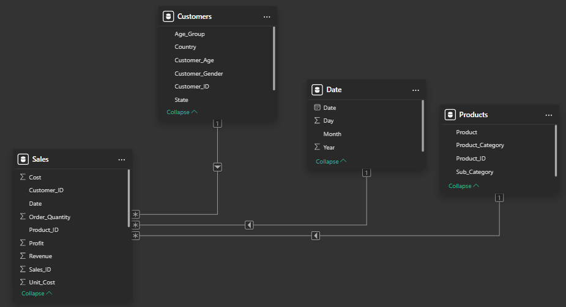
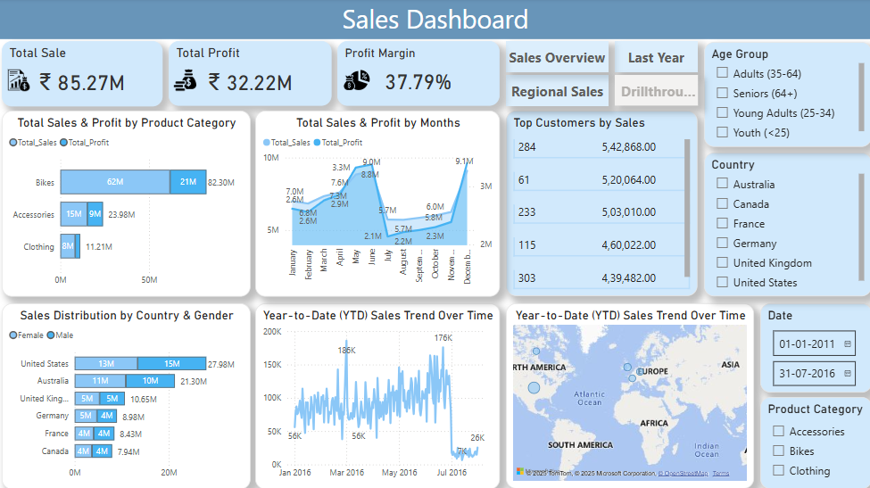

# 📊 Power BI Sales Dashboard  
🚀 *End-to-End Sales Analysis using Power BI, DAX, and Data Modeling*  

## 📖 Table of Contents  
- [Project Overview](#-project-overview)  
- [Dataset & Star Schema](#-dataset--star-schema)  
- [Key Features & Steps](#-key-features--steps)  
- [DAX Measures & Calculations](#-dax-measures--calculations)  
- [Filters & Drillthrough](#-filters--drillthrough)  
- [Deployment to Power BI Service](#-deployment-to-power-bi-service)  
- [Advanced Enhancements](#-advanced-enhancements)  
- [Dashboard Preview](#-dashboard-preview)  
- [How to Use](#-how-to-use)  
- [Tools & Technologies Used](#-tools--technologies-used)  
- [Conclusion](#-conclusion)  
- [Connect with Me](#-connect-with-me)  


## 📌 Project Overview  
This project is a **fully interactive Power BI dashboard** that analyzes sales data. It covers everything from **data extraction, transformation, modeling, visualization**, and **report deployment** in Power BI Service.  

## 📂 Dataset & Star Schema  

- **Source:** [Sales Data CSV](https://raw.githubusercontent.com/ine-rmotr-curriculum/FreeCodeCamp-Pandas-Real-Life-Example/refs/heads/master/data/sales_data.csv)  
- **Data Size:** 113,036 records  
- **Schema Used:** **Star Schema**  

### 📌 Tables & Relationships  

### 1️⃣ Customers (Dimension Table)  
   - `Customer_ID` (PK)  
   - `Customer_Age`  
   - `Age_Group`  
   - `Customer_Gender`  
   - `Country`  
   - `State`  

### 2️⃣ Products (Dimension Table)  
   - `Product_ID` (PK)  
   - `Product_Category`  
   - `Sub_Category`  
   - `Product_Name`  

### 3️⃣ Date (Dimension Table)  
   - `Date` (PK)  
   - `Day`  
   - `Month`  
   - `Year`  

### 4️⃣ Sales (Fact Table) *(Central Table in Star Schema)*  
   - `Sales_ID` (PK)  
   - `Customer_ID` (FK) → **Customers**  
   - `Product_ID` (FK) → **Products**  
   - `Date` (FK) → **Date**  
   - `Order_Quantity`  
   - `Unit_Cost`  
   - `Unit_Price`  
   - `Profit`  
   - `Cost`  
   - `Revenue`  

## 🔗 Schema Diagram  
   

---

## 🔹 Key Features & Steps  

### 1️⃣ Data Preparation (Power Query Editor)
✔ Imported **4 CSV files**: *Customers, Products, Date, and Sales*.  
✔ Cleaned & transformed data:  
   - Removed **unnecessary columns**  
   - Fixed **missing values** (Filled down, replaced nulls)  
   - Standardized **data types**  

### 2️⃣ Data Modeling (Relationships)
✔ Created a **Star Schema**:  
   - **Customers** → (1:M) → **Sales**  
   - **Products** → (1:M) → **Sales**  
   - **Date** → (1:M) → **Sales**  
✔ Optimized relationships to **improve performance**  

### 3️⃣ DAX Measures & Calculations
✔ **Total Sales** → `SUM(Sales[Revenue])`  
✔ **Profit Margin** → `DIVIDE([Total_Profit], [Total_Sales])`  
✔ **Year-to-Date (YTD) Sales**  
✔ **Month-over-Month (MoM) Growth**

### 4️⃣ Interactive Dashboard & Visuals
✔ **Key Metrics (Cards):** Total Sales, Profit, and Profit Margin  
✔ **Sales Breakdown (Charts):**  
   - **Clustered Column Chart** (Sales by Product Category)  
   - **Stacked Bar Chart** (Revenue by Country & Gender)  
   - **Line Chart** (YTD Sales)  
   - **Area Chart** (Monthly Revenue Trend)  
✔ **Geo Insights:** Map visualization (Sales by Country)  
✔ **Filters & Slicers:** Date, Product Category, Country, Age_Group 

### 5️⃣ Deployment & Sharing
✔ **Published to Power BI Service**  
✔ **Enabled Row-Level Security (RLS)**

---

## 🎯 DAX Measures & Calculations  
Below are the **DAX formulas** used in this project:  

🔹 **Total Sales Revenue**  
```DAX  
Total_Sales = SUM(Sales[Revenue])
```

🔹 **Profit Margin**
```DAX
Profit_Margin = DIVIDE([Total_Profit], [Total_Sales])
```
  
🔹 **Total Sales YTD (Year-to-Date)**
```DAX
YTD_Sales = TOTALYTD(SUM(Sales[Revenue]), 'Date'[Date])
```
 
🔹 **Rank Products by Sales**
```DAX
Rank_Products = RANKX(ALL(Products), [Total_Sales], , DESC, Dense)  
```

---

## 🎛 Filters & Drillthrough  
✅ **Visual Level Filter:** Show **Top 10 Products by Sales**  
✅ **Page Level Filter:** Show **Top 5 Customers by Sales** 
✅ **Report Level Filter:** Apply **Global Filters**  
✅ **Sync Slicers:** Sync **Date filter** across all pages  
✅ **Drillthrough Button:** Initially disabled, it activates when a Product Category is selected, allowing deeper insights into sales data. 

---

## 🚀 Deployment to Power BI Service  
### ✅ Publish Report  
1. Click **Home** → **Publish** to upload the report to **Power BI Service**  
2. Open **Power BI Online**  
3. Create a **New Workspace** & upload the report  
4. Set up **Row-Level Security (RLS)** to control **data access** 

---


## 📈 Advanced Enhancements  
✅ **Bookmarks & Page Navigation** for **dynamic storytelling**  
✅ **Dynamic Titles & DAX Variables** for better insights

---


## 📸 Dashboard Preview  
*(Add a screenshot here)*  
  

---

## 📌 How to Use  
1. **Clone the repo** or download the `.pbix` file  
2. Open in **Power BI Desktop**  
3. Explore the **interactive visuals & filters**  
4. Modify or extend DAX calculations if needed  
5. Publish to **Power BI Service**  

---

## 🛠 Tools & Technologies Used  
✔ **Power BI Desktop & Power BI Service**  
✔ **DAX (Data Analysis Expressions)**  
✔ **Power Query (Data Transformation)**  
✔ **SQL (Data Modeling Concepts)**  
✔ **Excel & CSV Data Processing**  
✔ **Python (Distributing Single dataset to multiple columns for Star Schema)**  

---

## 📢 Conclusion  
This project **demonstrates end-to-end data analysis** in Power BI—covering **data cleaning, transformation, modeling, visualization**, and **deployment**. 📊 It’s perfect for **business insights, trend analysis, and decision-making**.  


✅ If you found this project useful, don't forget to ⭐ the repository!  
📩 Feel free to reach out for collaborations, improvements, or discussions.  

---

## 🔗 Connect with Me  
📧 Email: sachinbhopiofficial@gmail.com <br/>
💼 LinkedIn: [LinkedIn](https://www.linkedin.com/in/sachinbhopi/)  
🚀 GitHub: [GitHub](https://github.com/b-sachin)  
